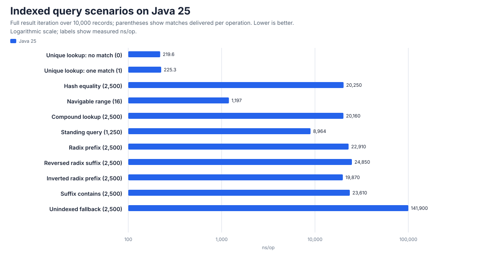
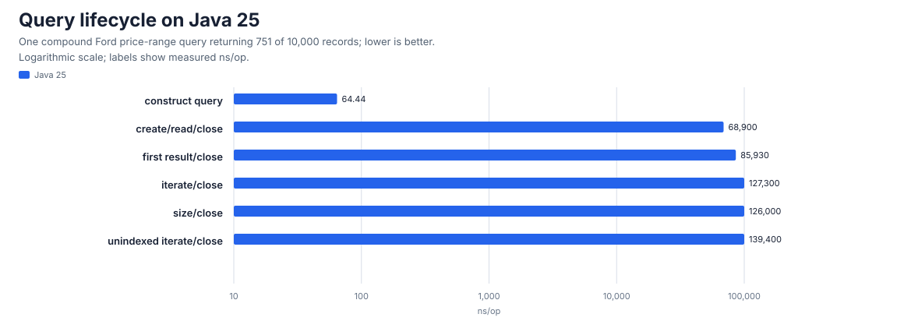
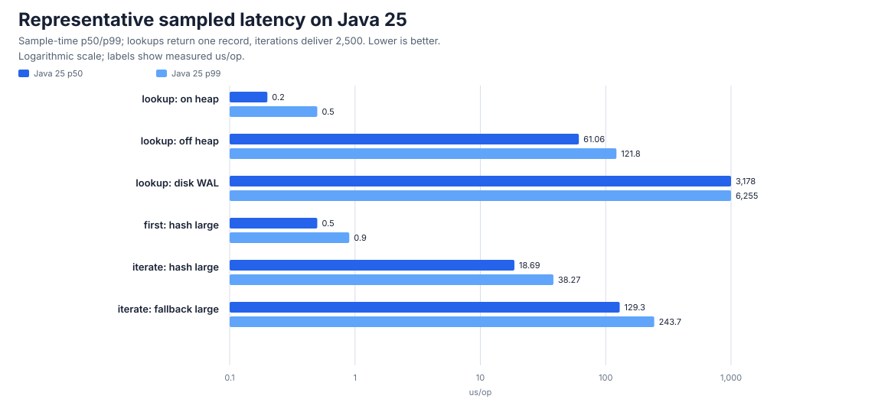
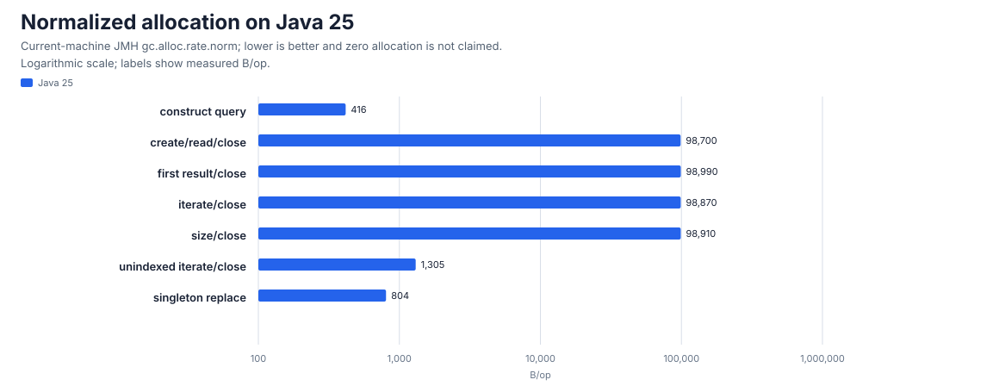

# CQEngine - Collection Query Engine #

CQEngine 4.0 continues Niall Gallagher's original CQEngine project, keeping it current and maintained for modern
Java applications. It preserves the `com.googlecode.cqengine` API and module identity, compiles to Java 21 bytecode,
and is verified on Java 21 and Java 25.

CQEngine is an indexed Java collection with SQL-like and programmatic query APIs. Suitable indexes can reduce the
work required for selective queries and can avoid repeated database lookups. Actual latency, throughput, allocation
and memory use depend on the data, query, indexes, result cardinality, persistence mode and how fully callers consume
and close each `ResultSet`. See the [benchmark guide](documentation/Benchmark.md).

Supports on-heap persistence, off-heap persistence, disk persistence, and supports MVCC transaction isolation.

Reviews of the original CQEngine project:
  * [dzone.com: Comparing the search performance of CQEngine with standard Java collections](https://dzone.com/articles/comparing-search-performance)
  * [dzone.com: Getting started with CQEngine: LINQ for Java, only faster](https://dzone.com/articles/getting-started-cqengine-linq)
  * CQEngine in the wild: [excelian.com](http://www.excelian.com/exposure-and-counterparty-limit-checking) | [gravity4.com](http://gravity4.com/welcome-gravity4-engineering-blog/) | [snapdeal.com](http://engineering.snapdeal.com/how-were-building-a-system-to-scale-for-billions-of-requests-per-day-201601/) (3-5 billion requests/day)

## The Limits of Iteration ##
The classic way to retrieve objects matching some criteria from a collection, is to iterate through the collection and apply some tests to each object. If the object matches the criteria, then it is added to a result set. This is repeated for every object in the collection.

A full scan performs O(_n_ _t_) predicate work, where _n_ is collection size and _t_ is the predicate cost. Maintained
indexes can reduce that work for suitable query shapes, but their value depends on lookup selectivity, result
consumption and update cost. [Read more: The Limits of Iteration](documentation/TheLimitsOfIteration.md)

---


## CQEngine Overview ##

CQEngine can avoid full collection scans by building _indexes_ on object fields and applying set-based query
planning. The benefit depends on the selected indexes, query shape and result consumption; it is not a latency or
allocation guarantee.

**Indexing and Query Plan Optimization**

  * **Simple Indexes** can be added to any number of individual fields in a collection of objects. A hash index can provide expected O(_1_) equality lookup before result traversal; other index and query types have different costs
  * **Multiple indexes on the same field** can be added, each optimized for different types of query - for example equality, numerical range, string starts with etc.
  * **Compound Indexes** can span multiple fields. Exact compound lookups can avoid a scan, but lookup, intersection and result-consumption costs still depend on the selected index and cardinality
  * **Nested Queries** are fully supported, such as the SQL equivalent of "`WHERE color = 'blue' AND(NOT(doors = 2 OR price > 53.00))`"
  * **Standing Query Indexes** can be added for _arbitrarily complex queries_ or _nested query fragments_. They provide direct access to the maintained matching set, while iterating or materializing that set remains proportional to the results consumed. Large queries can use matching standing indexes to accelerate individual branches
  * **Statistical Query Plan Optimization** - when several fields have suitable indexes, CQEngine uses index statistics to select a lower-cost query plan. When only some referenced fields have suitable indexes, CQEngine uses those indexes first and filters their results for the remaining predicates. That can reduce work relative to O(_n_), depending on selectivity and result consumption
  * **Iteration fallback** -  if no suitable indexes are available, CQEngine will evaluate the query via iteration, using lazy evaluation. CQEngine can always evaluate every query, even if no suitable indexes are available. Queries are not coupled with indexes, so indexes can be added after the fact, to speed up existing queries
  * **Concurrent collection variants** update registered indexes as objects are added and removed. Their documented
    isolation and locking semantics differ; callers must select the variant appropriate to their workload
  * **Type-safe** - nearly all errors in queries result in _compile-time_ errors instead of exceptions at runtime: all indexes, and all queries, are strongly typed using generics at both object-level and field-level
  * **On-heap/off-heap/disk** - objects can be stored on-heap (like a conventional Java collection), or off-heap (in native memory, within the JVM process but outside the Java heap), or persisted to disk

Several implementations of CQEngine's `IndexedCollection` are provided, supporting various concurrency and transaction isolation levels:

  * [ConcurrentIndexedCollection](src/main/java/com/googlecode/cqengine/ConcurrentIndexedCollection.java) - lock-free concurrent reads and writes with no transaction isolation
  * [ObjectLockingIndexedCollection](src/main/java/com/googlecode/cqengine/ObjectLockingIndexedCollection.java) - lock-free concurrent reads, and some locking of writes for object-level transaction isolation and consistency guarantees
  * [TransactionalIndexedCollection](src/main/java/com/googlecode/cqengine/TransactionalIndexedCollection.java)  - lock-free concurrent reads, and sequential writes for full [transaction isolation](documentation/TransactionIsolation.md) using Multi-Version Concurrency Control

For more details see [TransactionIsolation](documentation/TransactionIsolation.md).

---

## Benchmarks ##

The JMH suite measures query lifecycle, indexed query scenarios, mutation, persistence, concurrency, sampled latency
and JVM allocation as distinct workloads on Java 21 and Java 25. The charts below come from the latest full
benchmark run, measured on a Windows 11 virtual machine with 12 logical CPU cores on an Intel Core i7-10750H.
The numbers describe that machine only. Headlines from that run:

  * An indexed unique lookup answers in about 225 ns. The same equality shape without an index takes about 7× as
    long as its indexed equivalent at the same match count, because it scans the whole collection.
  * Delivering results dominates large queries: once an index has located 2,500 matching records, iterating them
    costs about 8 ns per record, which is why hash, compound and string indexes land in one band below.
  * Results stream lazily: on a 2,500-match query the first record arrives in about 0.5 µs at p50, long before
    full iteration completes.
  * Query allocation is per result-set lifecycle, not per record: consuming 0 or all 751 results of the lifecycle
    query allocates the same ~99 KB, and a single indexed record replacement runs in about 0.5 µs allocating 804 B.









Drill down:

  * [Representative results](benchmarks/results/4.0.0-development/d9447adb-win11-i7-10750h-12c-01/representative-results.md) —
    the full tables behind these charts, with the indexes, queries, exact match counts and how to read each number
  * [How the benchmarks are constructed](benchmarks/results/README.md) — the dataset, the query shapes, the
    measurement contract and how a run becomes committed evidence
  * [Benchmark guide](documentation/Benchmark.md) — methodology, machine boundary and interpretation rules

---

## Complete Example ##

In CQEngine applications mostly interact with [IndexedCollection](src/main/java/com/googlecode/cqengine/IndexedCollection.java), which is an implementation of [java.util.Set](http://docs.oracle.com/javase/6/docs/api/java/util/Set.html), and it provides two additional methods:

  * [addIndex(SomeIndex)](src/main/java/com/googlecode/cqengine/engine/QueryEngine.java) allows indexes to be added to the collection
  * [retrieve(Query)](src/main/java/com/googlecode/cqengine/engine/QueryEngine.java) accepts a [Query](src/main/java/com/googlecode/cqengine/query/Query.java) and returns a [ResultSet](src/main/java/com/googlecode/cqengine/resultset/ResultSet.java) providing objects matching that query. `ResultSet` implements [java.lang.Iterable](http://docs.oracle.com/javase/6/docs/api/java/lang/Iterable.html), so accessing results is achieved by iterating the result set, or accessing it as a Java 8+ Stream

Here is a **complete example** of how to build a collection, add indexes and perform queries. It does not discuss _attributes_, which are discussed below.

**STEP 1: Create a new indexed collection**

```java
IndexedCollection<Car> cars = new ConcurrentIndexedCollection<Car>();
```

**STEP 2: Add some indexes to the collection**

```java
cars.addIndex(NavigableIndex.onAttribute(Car.CAR_ID));
cars.addIndex(ReversedRadixTreeIndex.onAttribute(Car.NAME));
cars.addIndex(SuffixTreeIndex.onAttribute(Car.DESCRIPTION));
cars.addIndex(HashIndex.onAttribute(Car.FEATURES));
```

**STEP 3: Add some objects to the collection**

```java
cars.add(new Car(1, "ford focus", "great condition, low mileage", Arrays.asList("spare tyre", "sunroof")));
cars.add(new Car(2, "ford taurus", "dirty and unreliable, flat tyre", Arrays.asList("spare tyre", "radio")));
cars.add(new Car(3, "honda civic", "has a flat tyre and high mileage", Arrays.asList("radio")));
```


**STEP 4: Run some queries**

Note: add import statement to your class: _`import static com.googlecode.cqengine.query.QueryFactory.*`_

Every `ResultSet` is closeable. Use try-with-resources whenever the caller consumes a result locally; this remains
correct if the collection later gains an index or persistence implementation which owns external resources.

* *Example 1: Find cars whose name ends with 'vic' or whose id is less than 2*

  Query:
  ```java
    Query<Car> query1 = or(endsWith(Car.NAME, "vic"), lessThan(Car.CAR_ID, 2));
    try (ResultSet<Car> results = cars.retrieve(query1)) {
        results.forEach(System.out::println);
    }
  ```
  Prints:
  ```
    Car{carId=3, name='honda civic', description='has a flat tyre and high mileage', features=[radio]}
    Car{carId=1, name='ford focus', description='great condition, low mileage', features=[spare tyre, sunroof]}
  ```
  
* *Example 2: Find cars whose flat tyre can be replaced*

  Query:
  ```java
    Query<Car> query2 = and(contains(Car.DESCRIPTION, "flat tyre"), equal(Car.FEATURES, "spare tyre"));
    try (ResultSet<Car> results = cars.retrieve(query2)) {
        results.forEach(System.out::println);
    }
  ```
  Prints:
  ```
    Car{carId=2, name='ford taurus', description='dirty and unreliable, flat tyre', features=[spare tyre, radio]}
  ```
  
* *Example 3: Find cars which have a sunroof or a radio but are not dirty*

  Query:
  ```java
    Query<Car> query3 = and(in(Car.FEATURES, "sunroof", "radio"), not(contains(Car.DESCRIPTION, "dirty")));
    try (ResultSet<Car> results = cars.retrieve(query3)) {
        results.forEach(System.out::println);
    }
  ```
   Prints:
  ```
    Car{carId=1, name='ford focus', description='great condition, low mileage', features=[spare tyre, sunroof]}
    Car{carId=3, name='honda civic', description='has a flat tyre and high mileage', features=[radio]}
  ```

Complete source code for these examples is under
[`src/test/java/com/googlecode/cqengine/examples/introduction/`](src/test/java/com/googlecode/cqengine/examples/introduction/).

---

## String-based queries: SQL and CQN dialects ##

As an alternative to programmatic queries, CQEngine also has support for running string-based queries on the collection, in either SQL or CQN (CQEngine Native) format.

Both parsers enforce finite input, token and nesting limits. CQN regular expressions retain an explicitly named
trusted-compatibility policy by default and can be disabled or replaced for untrusted boundaries. See
[SQL and CQN string queries](documentation/StringQueries.md) for configuration and the exact trust contract.

Example of running an SQL query on a collection (full source
[here](src/test/java/com/googlecode/cqengine/examples/parser/SQLQueryDemo.java)):
```java
public static void main(String[] args) {
    SQLParser<Car> parser = SQLParser.forPojoWithAttributes(Car.class, createAttributes(Car.class));
    IndexedCollection<Car> cars = new ConcurrentIndexedCollection<Car>();
    cars.addAll(CarFactory.createCollectionOfCars(10));

    try (ResultSet<Car> results = parser.retrieve(cars, "SELECT * FROM cars WHERE (" +
            "(manufacturer = 'Ford' OR manufacturer = 'Honda') " +
            "AND price <= 5000.0 " +
            "AND color NOT IN ('GREEN', 'WHITE')) " +
            "ORDER BY manufacturer DESC, price ASC")) {
        results.forEach(System.out::println); // Prints: Honda Accord, Ford Fusion, Ford Focus
    }
}
```

Example of running a CQN query on a collection (full source
[here](src/test/java/com/googlecode/cqengine/examples/parser/CQNQueryDemo.java)):
```java
public static void main(String[] args) {
    CQNParser<Car> parser = CQNParser.forPojoWithAttributes(Car.class, createAttributes(Car.class));
    IndexedCollection<Car> cars = new ConcurrentIndexedCollection<Car>();
    cars.addAll(CarFactory.createCollectionOfCars(10));

    try (ResultSet<Car> results = parser.retrieve(cars,
            "and(" +
                "or(equal(\"manufacturer\", \"Ford\"), equal(\"manufacturer\", \"Honda\")), " +
                "lessThanOrEqualTo(\"price\", 5000.0), " +
                "not(in(\"color\", GREEN, WHITE))" +
            ")")) {
        results.forEach(System.out::println); // Prints: Ford Focus, Ford Fusion, Honda Accord
    }
}
```

---

## Feature Matrix for Included Indexes ##

**Legend for the feature matrix**

| **Abbreviation** | **Meaning** | **Example** |
|:-----------------|:------------|:------------|
| **EQ**           | _Equality_  | `equal(Car.DOORS, 4)` |
| **IN**           | _Equality, multiple values_ | `in(Car.DOORS, 3, 4, 5)` |
| **LT**           | _Less Than (numerical range / `Comparable`)_ | `lessThan(Car.PRICE, 5000.0)` |
| **GT**           | _Greater Than (numerical range / `Comparable`)_ | `greaterThan(Car.PRICE, 2000.0)` |
| **BT**           | _Between (numerical range / `Comparable`)_ | `between(Car.PRICE, 2000.0, 5000.0)` |
| **SW**           | _String Starts With_ | `startsWith(Car.NAME, "For")` |
| **EW**           | _String Ends With_ | `endsWith(Car.NAME, "ord")` |
| **SC**           | _String Contains_ | `contains(Car.NAME, "or")` |
| **CI**           | _String Is Contained In_ | `isContainedIn(Car.NAME, "I am shopping for a Ford Focus car")` |
| **RX**           | _String Matches Regular Expression_ | `matchesRegex(Car.MODEL, "Ford.*")` |
| **HS**           | _Has (aka `IS NOT NULL`)_ | `has(Car.DESCRIPTION)` / `not(has(Car.DESCRIPTION))` |
| **SQ**           | _Standing Query_ | _Can the index accelerate a query (as opposed to an attribute) to provide constant time complexity for any simple query, complex query, or fragment_ |
| **QZ**           | _Quantization_ | _Does the index accept a quantizer to control granularity_ |
| **LP**           | _LongestPrefix_ | `longestPrefix(Car.NAME, "Ford")` |

Note: CQEngine also supports complex queries via **`and`**, **`or`**, **`not`**, and combinations thereof, across all indexes.

**Index Feature Matrix**

| <sub>**Index Type**</sub> | <sub>**EQ**</sub> | <sub>**IN**</sub> | <sub>**LT**</sub> | <sub>**GT**</sub> | <sub>**BT**</sub> | <sub>**SW**</sub> | <sub>**EW**</sub> | <sub>**SC**</sub> | <sub>**CI**</sub> | <sub>**HS**</sub> | <sub>**RX**</sub> | <sub>**SQ**</sub> | <sub>**QZ**</sub> | <sub>**LP**</sub> |
|:---------------|:-------|:-------|:-------|:-------|:-------|:-------|:-------|:-------|:-------|:-------|:-------|:-------|:-------|:-------|
| [<sub>Hash</sub>](src/main/java/com/googlecode/cqengine/index/hash/HashIndex.java) | ✓      | ✓      |        |        |        |        |        |        |        |        |        |        | ✓      |        |
| [<sub>Unique</sub>](src/main/java/com/googlecode/cqengine/index/unique/UniqueIndex.java) | ✓      | ✓      |        |        |        |        |        |        |        |        |        |        |        |        |
| [<sub>Compound</sub>](src/main/java/com/googlecode/cqengine/index/compound/CompoundIndex.java) | ✓      | ✓      |        |        |        |        |        |        |        |        |        |        | ✓      |        |
| [<sub>Navigable</sub>](src/main/java/com/googlecode/cqengine/index/navigable/NavigableIndex.java) | ✓      | ✓      | ✓      | ✓      | ✓      |        |        |        |        |        |        |        | ✓      |        |
| [<sub>PartialNavigable</sub>](src/main/java/com/googlecode/cqengine/index/navigable/PartialNavigableIndex.java) | ✓      | ✓      | ✓      | ✓      | ✓      |        |        |        |        |        |        | ✓      |        |        |
| [<sub>RadixTree</sub>](src/main/java/com/googlecode/cqengine/index/radix/RadixTreeIndex.java) | ✓      | ✓      |        |        |        | ✓      |        |        |        |        |        |        |        |        |
| [<sub>ReversedRadixTree</sub>](src/main/java/com/googlecode/cqengine/index/radixreversed/ReversedRadixTreeIndex.java) | ✓      | ✓      |        |        |        |        | ✓      |        |        |        |        |        |        |        |
| [<sub>InvertedRadixTree</sub>](src/main/java/com/googlecode/cqengine/index/radixinverted/InvertedRadixTreeIndex.java) | ✓      | ✓      |        |        |        |        |        |        | ✓      |        |        |        |        | ✓      |
| [<sub>SuffixTree</sub>](src/main/java/com/googlecode/cqengine/index/suffix/SuffixTreeIndex.java) | ✓      | ✓      |        |        |        |        | ✓      | ✓      |        |        |        |        |        |        |
| [<sub>StandingQuery</sub>](src/main/java/com/googlecode/cqengine/index/standingquery/StandingQueryIndex.java) |        |        |        |        |        |        |        |        |        |        |        | ✓      |        |        |
| [<sub>Fallback</sub>](src/main/java/com/googlecode/cqengine/index/fallback/FallbackIndex.java) | ✓      | ✓      | ✓      | ✓      | ✓      | ✓      | ✓      | ✓      | ✓      | ✓      | ✓      |        |        | ✓      |
| [<sub>OffHeap</sub>](src/main/java/com/googlecode/cqengine/index/offheap/OffHeapIndex.java) | ✓      | ✓      | ✓      | ✓      | ✓      | ✓      |        |        |        |        |        | ✓<sup>[1]</sup>      |        |        |
| [<sub>PartialOffHeap</sub>](src/main/java/com/googlecode/cqengine/index/offheap/PartialOffHeapIndex.java) | ✓      | ✓      | ✓      | ✓      | ✓      | ✓      |        |        |        |        |        | ✓      |        |        |
| [<sub>Disk</sub>](src/main/java/com/googlecode/cqengine/index/disk/DiskIndex.java) | ✓      | ✓      | ✓      | ✓      | ✓      | ✓      |        |        |        |        |        | ✓<sup>[1]</sup>      |        |        |
| [<sub>PartialDisk</sub>](src/main/java/com/googlecode/cqengine/index/disk/PartialDiskIndex.java) | ✓      | ✓      | ✓      | ✓      | ✓      | ✓      |        |        |        |        |        | ✓      |        |        |
<sup>[1]</sup> See: [forStandingQuery()](src/main/java/com/googlecode/cqengine/query/QueryFactory.java)

The [benchmark guide](documentation/Benchmark.md) contains the current JMH methodology and the original CQEngine
results retained as project history.

---

## Attributes ##

### Read Fields ###

CQEngine needs to access fields inside objects, so that it can build indexes on fields, and retrieve the value of a certain field from any given object.

CQEngine does not use reflection to do this; instead it uses **attributes**, which is a more powerful concept. An attribute is an accessor object which can read the value of a certain field in a POJO.

Here's how to define an attribute for a Car object (a POJO), which reads the `Car.carId` field:
```java
public static final Attribute<Car, Integer> CAR_ID = new SimpleAttribute<Car, Integer>("carId") {
    public Integer getValue(Car car, QueryOptions queryOptions) { return car.carId; }
};
```
...or alternatively, from a lambda expression or method reference:
```java
public static final Attribute<Car, Integer> CAR_ID =
        simpleAttribute(Car.class, Integer.class, "carId", Car::getCarId);
```
(For some caveats on using lambdas, please read [LambdaAttributes](documentation/LambdaAttributes.md))

Usually attributes are defined as anonymous `static` `final` objects like this. Supplying the `"carId"` string parameter to the constructor is actually optional, but it is recommended as it will appear in query `toString`s.

Since this attribute reads a field from a `Car` object, the usual place to put the attribute is inside the `Car` class - and this makes queries more readable. However it could really be defined in any class, such as in a `CarAttributes` class or similar. The example above is for a **[SimpleAttribute](src/main/java/com/googlecode/cqengine/attribute/SimpleAttribute.java)**, which is designed for fields containing only one value.

CQEngine also supports **[MultiValueAttribute](src/main/java/com/googlecode/cqengine/attribute/MultiValueAttribute.java)** which can read the values of fields which themselves are collections. And so it supports building indexes on objects based on things like keywords associated with those objects.

Here's how to define a `MultiValueAttribute` for a `Car` object which reads the values from `Car.features` where that field is a `List<String>`:
```java
public static final Attribute<Car, String> FEATURES = new MultiValueAttribute<Car, String>("features") {
    public Iterable<String> getValues(Car car, QueryOptions queryOptions) { return car.features; }
};
```
...or alternatively, from a lambda expression or method reference:
```java
public static final Attribute<Car, String> FEATURES =
        multiValueAttribute(Car.class, String.class, "features", Car::getFeatures);
```

#### Null values ####
Note **if your data contains `null` values**, you should use **[SimpleNullableAttribute](src/main/java/com/googlecode/cqengine/attribute/SimpleNullableAttribute.java)** or **[MultiValueNullableAttribute](src/main/java/com/googlecode/cqengine/attribute/MultiValueNullableAttribute.java)** instead.

In particular, note that `SimpleAttribute` and `MultiValueAttribute` do not perform any null checking on your data, and so if your data inadvertently contains null values, you may get obscure `NullPointerException`s. This is because null checking does not come for free. Attributes are accessed heavily, and the non-nullable versions of these attributes are designed to minimize latency by skipping explicit null checks. They defer to the JVM to do the null checking implicitly. 

As a rule of thumb, if you get a `NullPointerException`, it's probably because you used the wrong type of attribute. The problem will usually go away if you switch your code to use a nullable attribute instead. If you don't know if your data may contain null values, just use the nullable attributes. They contain the logic to check for and handle null values automatically.

The nullable attributes also allow CQEngine to work with [object inheritance](src/test/java/com/googlecode/cqengine/examples/inheritance), where some objects in the collection have certain optional fields (e.g. in subclasses) while others might not.

#### Creating queries dynamically ####

Dynamic queries can be composed at runtime by instantiating and combining Query objects directly; see [this package](src/main/java/com/googlecode/cqengine/query/simple/) and [this package](src/main/java/com/googlecode/cqengine/query/logical/). For advanced cases, it is also possible to define attributes at runtime, using [ReflectiveAttribute](src/main/java/com/googlecode/cqengine/attribute/ReflectiveAttribute.java) or [AttributeBytecodeGenerator](src/main/java/com/googlecode/cqengine/codegen/AttributeBytecodeGenerator.java).

#### Generate attributes automatically ####

CQEngine also provides several ways to generate attributes automatically.

Note these are an alternative to using [ReflectiveAttribute](src/main/java/com/googlecode/cqengine/attribute/ReflectiveAttribute.java), which was discussed above. Whereas `ReflectiveAttribute` is a special type of attribute which reads values at runtime using reflection, `AttributeSourceGenerator` and `AttributeBytecodeGenerator` generate code for attributes which is compiled and so does not use reflection at runtime, which can be more efficient.

  * [AttributeSourceGenerator](src/main/java/com/googlecode/cqengine/codegen/AttributeSourceGenerator.java) can automatically generate the source code for the simple and multi-value attributes discussed above.
  * [AttributeBytecodeGenerator](src/main/java/com/googlecode/cqengine/codegen/AttributeBytecodeGenerator.java) can automatically generate the class bytecode for the simple and multi-value attributes discussed above, and load them into the application at runtime as if they had been compiled from source code.

See [AutoGenerateAttributes](documentation/AutoGenerateAttributes.md) for more details.

### Attributes as Functions ###

It can be noted that attributes are only required to return a value given an object. Although most will do so, there is no requirement that an attribute must provide a value by reading a field in the object. As such attributes can be _virtual_, implemented as _functions_.

**Calculated Attributes**

An attribute can **_calculate_** an appropriate value for an object, based on a function applied to data contained in other fields or from external data sources.

Here's how to define a calculated (or virtual) attribute by applying a function over the Car's other fields:
```java
public static final Attribute<Car, Boolean> IS_DIRTY = new SimpleAttribute<Car, Boolean>("is_dirty") {
    public Boolean getValue(Car car, QueryOptions queryOptions) { return car.description.contains("dirty"); }
};
```
...or, the same thing using a lambda:
```java
public static final Attribute<Car, Boolean> IS_DIRTY =
        simpleAttribute(Car.class, Boolean.class, "is_dirty", car -> car.description.contains("dirty"));
```

A `HashIndex` could be built on the virtual attribute above, enabling fast retrievals of cars which are either dirty or not dirty, without needing to scan the collection.

**Associations with other `IndexedCollections` or External Data Sources**

Here is an example for a virtual attribute which **associates** with each `Car` a list of locations which can service it, from an external data source:
```java
public static final Attribute<Car, String> SERVICE_LOCATIONS = new MultiValueAttribute<Car, String>() {
    public List<String> getValues(Car car, QueryOptions queryOptions) {
        return CarServiceManager.getServiceLocationsForCar(car);
    }
};
```
The attribute above would allow the `IndexedCollection` of cars to be searched for cars which have _servicing options in a particular location_.

The locations which service a car, could alternatively be retrieved from another `IndexedCollection`, of `Garage`s, for example. **Care should be taken if building indexes on virtual attributes** however, if referenced data might change leaving obsolete information in indexes. A **strategy to accommodate this** is: if no index exists for a virtual attribute referenced in a query, and other attributes are also referenced in the query for which indexes exist, CQEngine will automatically reduce the candidate set of objects to the minimum using other indexes before querying the virtual attribute. In turn if virtual attributes perform retrievals from _other_ `IndexedCollection`s, then those collections could be indexed appropriately without a risk of stale data.

---

### Joins ###

The examples above define attributes on a primary `IndexedCollection` which read data from secondary collections or external data sources.

It is also possible to perform SQL EXISTS-type queries and JOINs between `IndexedCollection`s on the query side (as opposed to on the attribute side). See [Joins](documentation/Joins.md) for examples.


---


## Persistence on-heap, off-heap, disk ##

CQEngine's `IndexedCollection`s can be configured to store objects added to them on-heap (the default), or off-heap, or on disk.

**On-heap**

Store the collection on the Java heap:
```java
IndexedCollection<Car> cars = new ConcurrentIndexedCollection<Car>();
```

**Off-heap**

Store the collection in native memory, within the JVM process but outside the Java heap:
```java
IndexedCollection<Car> cars = new ConcurrentIndexedCollection<Car>(OffHeapPersistence.onPrimaryKey(Car.CAR_ID));
```

Note that the off-heap persistence will automatically create an index on the specified primary key attribute, so there is no need to add an index on that attribute later.

**Disk**

Store the collection in a temp file on disk (then see `DiskPersistence.getFile()`):
```java
IndexedCollection<Car> cars = new ConcurrentIndexedCollection<Car>(DiskPersistence.onPrimaryKey(Car.CAR_ID));
```
Or, store the collection in a particular file on disk:
```java
IndexedCollection<Car> cars = new ConcurrentIndexedCollection<Car>(DiskPersistence.onPrimaryKeyInFile(Car.CAR_ID, new File("cars.dat")));
```

Note that the disk persistence will automatically create an index on the specified primary key attribute, so there is no need to add an index on that attribute later.

**Wrapping**

Wrap any Java collection, in a CQEngine IndexedCollection without any copying of objects.
 * This can be a convenient way to run queries or build indexes on existing collections.
 * However some caveats relating to concurrency support and the performance of the underlying collection apply, see [WrappingPersistence](src/main/java/com/googlecode/cqengine/persistence/wrapping/WrappingPersistence.java) for details.

```java
Collection<Car> collection = // obtain any Java collection

IndexedCollection<Car> indexedCollection = new ConcurrentIndexedCollection<Car>(
        WrappingPersistence.aroundCollection(collection)
);
```

**Composite**

`CompositePersistence` configures a combination of persistence types for use within the same collection.
The collection itself will be persisted in the first persistence provided (the _primary persistence_), and the additional persistences provided will be used by off-heap or disk indexes added to the collection subsequently.

Store the collection on-heap, and also configure DiskPersistence for use by DiskIndexes added to the collection subsequently:
```java
IndexedCollection<Car> cars = new ConcurrentIndexedCollection<Car>(CompositePersistence.of(
    OnHeapPersistence.onPrimaryKey(Car.CAR_ID),
    DiskPersistence.onPrimaryKeyInFile(Car.CAR_ID, new File("cars.dat"))
));
```

### Index persistence ###

Indexes can similarly be stored on-heap, off-heap, or on disk. Each index requires a certain type of persistence. It is necessary to configure the collection in advance with an appropriate combination of persistences for use by whichever indexes are added.

It is possible to store the collection on-heap while storing selected indexes off-heap or on disk, or to combine
several persistence types. Each choice has different heap, native-memory, disk, durability and latency costs. The
current JMH suite measures representative modes but establishes no universal ranking or capacity limit.

The original project reported tests with 10 million off-heap objects and 100 million disk-persisted objects. Those
historical scale observations are not current release evidence or a sizing commitment for CQEngine 4.0; qualify the
actual object graph, indexes, storage and host before adoption.

**On-heap**

Add an on-heap index on "manufacturer":
```java
cars.addIndex(NavigableIndex.onAttribute(Car.MANUFACTURER));
```

**Off-heap**

Add an off-heap index on "manufacturer":
```java
cars.addIndex(OffHeapIndex.onAttribute(Car.MANUFACTURER));
```

**Disk**

Add a disk index on "manufacturer":
```java
cars.addIndex(DiskIndex.onAttribute(Car.MANUFACTURER));
```

### Querying with persistence ###

Close every locally consumed `ResultSet`. This is required for off-heap, disk and transactional implementations, and
keeps calling code correct if resource-owning indexes are added later. Use a _try-with-resources_ block:
```java
try (ResultSet<Car> results = cars.retrieve(equal(Car.MANUFACTURER, "Ford"))) {
    results.forEach(System.out::println);
}
```
---

## Result Sets ##

CQEngine [ResultSet](src/main/java/com/googlecode/cqengine/resultset/ResultSet.java)s provide the following methods:

  * [iterator()](src/main/java/com/googlecode/cqengine/resultset/ResultSet.java) - Allows the `ResultSet` to be iterated, returning the next object matching the query in each iteration as determined via _lazy evaluation_
    * Result sets support **concurrent iteration** while the collection is being modified; the set of objects returned simply may or may not reflect changes made during iteration (depending on whether changes are made to areas of the collection or indexes already iterated or not)

  * [uniqueResult()](src/main/java/com/googlecode/cqengine/resultset/ResultSet.java) - Useful if the query is expected to only match one object, this method returns the first object which would be returned by the iterator, and it throws an exception if zero or more than one object is found

  * [size()](src/main/java/com/googlecode/cqengine/resultset/ResultSet.java) - Returns the number of objects which _would be returned by the `ResultSet` if it was iterated_; CQEngine can often **accelerate** this calculation of size, based on the sizes of individual sets in indexes; see JavaDoc for details

  * [contains()](src/main/java/com/googlecode/cqengine/resultset/ResultSet.java) -  Tests if a _given object_ would be contained in results matching a query; this is also an **accelerated** operation; when suitable indexes are available, CQEngine can avoid iterating results to test for containment; see JavaDoc for details

  * [getRetrievalCost()](src/main/java/com/googlecode/cqengine/resultset/ResultSet.java) - This is a metric used internally by CQEngine to allow it to _choose between multiple indexes_ which support the query. This could occasionally be used by applications to ascertain if suitable indexes are available for any particular query, this will be `Integer.MAX_VALUE` for queries for which no suitable indexes are available

  * [getMergeCost()](src/main/java/com/googlecode/cqengine/resultset/ResultSet.java) - This is a metric used internally by CQEngine to allow it to _re-order_ elements of the query to minimize time complexity; for example CQEngine will order intersections such that the smallest set drives the _merge_; this metric is _roughly_ based on the theoretical cost to iterate underlying result sets
    * For query fragments requiring _set union_ (`or`-based queries), this will be the _sum_ of merge costs from underlying result sets
    * For query fragments requiring _set intersection_ (`and`-based queries), this will be the _Math.min()_ of merge costs from underlying result sets, because intersections will be re-ordered to perform lowest-merge-cost intersections first
    * For query fragments requiring _set difference_ (`not`-based queries), this will be the merge cost from the first underlying result set

  * [stream()](src/main/java/com/googlecode/cqengine/resultset/ResultSet.java) - Returns a Java 8+ `Stream` allowing CQEngine results to be grouped, aggregated, and transformed in flexible ways using lambda expressions.
 
  * [close()](src/main/java/com/googlecode/cqengine/resultset/ResultSet.java) - Releases resources or the transaction opened for the query. Close every `ResultSet` you own, preferably with try-with-resources. If you wrap and return a result set, ownership transfers only when the wrapper's `close()` closes its delegate.
  
---

## Deduplicating Results ##

It is possible that a query would result in the same object being returned more than once.

For example if an object matches several attribute values specified in an `or`-type query, then the object will be returned multiple times, one time for each attribute matched. Intersections (`and`-type queries) and negations (`not`-type queries) do not produce duplicates.

By default, CQEngine does _not_ perform de-duplication of results; however it can be _instructed_ to do so, using various strategies such as Logical Elimination and Materialize. Read more: [DeduplicationStrategies](documentation/DeduplicationStrategies.md)

---


## Ordering Results ##

By default, CQEngine does not order results; it simply returns objects in the order it finds them in the collection or in indexes.

CQEngine can be instructed to order results via query options as follows.

**Order by price descending**
```java
try (ResultSet<Car> results = cars.retrieve(query, queryOptions(orderBy(descending(Car.PRICE))))) {
    results.forEach(System.out::println);
}
```

**Order by price descending, then number of doors ascending**
```java
try (ResultSet<Car> results = cars.retrieve(
        query, queryOptions(orderBy(descending(Car.PRICE), ascending(Car.DOORS))))) {
    results.forEach(System.out::println);
}
```

Note that ordering results as above uses the default _materialize_ ordering strategy. This is relatively expensive, dependent on the number of objects matching the query, and can cause latency in accessing the first object. It requires all results to be materialized into a sorted set up-front _before iteration can begin_.

### Index-accelerated ordering ###

CQEngine also has support to use an index to accelerate, or eliminate, the overhead of ordering results. This strategy reduces the latency to access the first object in the sorted results, at the expense of adding more total overhead if the entire ResultSet was iterated. Read more: [OrderingStrategies](documentation/OrderingStrategies.md)

---
## Merge Strategies ##

Merge strategies are the algorithms CQEngine uses to evaluate queries which have multiple branches.

By default CQEngine will use strategies which should suit most applications, however these strategies can be overridden to tune performance. Read more: [MergeStrategies](documentation/MergeStrategies.md)

---

## Index Quantization, Granularity, and tuning index size ##

[Quantization](http://en.wikipedia.org/wiki/Quantization_(signal_processing)) involves converting fine-grained or continuous values, to discrete or coarse-grained values. A Quantizer is a _function_ which takes fine-grained values as input, and maps those values to coarse-grained counterparts as its output, by discarding some precision.

Quantization can be a useful tool to tune the size of indexes, trading a reduction in index size, for increases in CPU overhead and vice-versa. Read more: [Quantization and included Quantizers](documentation/IndexQuantization.md)


---


## Grouping and Aggregation (GROUP BY, SUM...) ##

CQEngine has been designed with support for grouping and aggregation in mind, but note that this is not built into the CQEngine library itself, because CQEngine is designed to integrate with Java 8+ `Stream`s. This allows CQEngine results to be grouped, aggregated, and transformed in flexible ways using lambda expressions.

CQEngine `ResultSet` can be converted into a Java 8 `Stream` by calling `ResultSet.stream()`.

Note that Streams are **evaluated via filtering** and do not use CQEngine indexes. Put selective indexed predicates
in the CQEngine query when appropriate, then measure the complete workload; a stream-only scan and an indexed query
have different setup, update and result-consumption costs.

Here's how to transform a `ResultSet` into a `Stream`, to compute the distinct set of Colors of cars which match a CQEngine query.
```java
public static void main(String[] args) {
    IndexedCollection<Car> cars = new ConcurrentIndexedCollection<>();
    cars.addAll(CarFactory.createCollectionOfCars(10));
    cars.addIndex(NavigableIndex.onAttribute(Car.MANUFACTURER));

    Set<Car.Color> distinctColorsOfFordCars;
    try (ResultSet<Car> results = cars.retrieve(equal(Car.MANUFACTURER, "Ford"))) {
        distinctColorsOfFordCars = results.stream()
                .map(Car::getColor)
                .collect(Collectors.toSet());
    }

    System.out.println(distinctColorsOfFordCars); // prints: [GREEN, RED]
}
```

---

## Accessing Index Metadata and Statistics from MetadataEngine ##

The [MetadataEngine](src/main/java/com/googlecode/cqengine/metadata/MetadataEngine.java), is a high-level API which can retrieve metatadata and statistics from indexes which have been added to the collection.

It provides access to the following:
  * Frequency distributions (the counts of each attribute value stored in an index)
  * Distinct keys (the distinct attribute values in an index, optionally within a range between x and y)
  * Streams of attribute values and associated objects stored in an index (ascending/descending order, optionally within a range between x and y)
  * Count of distinct keys (how many distinct attribute values are in an index)
  * Count for a specific key (how many objects match a specific attribute value)

For more information, see JavaDocs for: [MetadataEngine](src/main/java/com/googlecode/cqengine/metadata/MetadataEngine.java), [AttributeMetadata](src/main/java/com/googlecode/cqengine/metadata/AttributeMetadata.java), [SortedAttributeMetadata](src/main/java/com/googlecode/cqengine/metadata/SortedAttributeMetadata.java)

---


## Using CQEngine with Hibernate / JPA / ORM Frameworks ##

CQEngine has seamless integration with JPA/ORM frameworks such as Hibernate or EclipseLink.

Simply put, CQEngine can build indexes on, and query, Java collections or arbitrary data sources. ORM frameworks
often return database entities in Java collections, so CQEngine can provide indexed in-memory queries over that data.


---


## Using CQEngine artifacts ##

The unreleased 4.0 final will use the `io.github.shuaibrao:cqengine` coordinate shown below. The current local release
release is `4.0.0`; use that version when consuming artifacts staged by this checkout.

```kotlin
dependencies {
    implementation("io.github.shuaibrao:cqengine:4.0.0")
}
```

The equivalent Maven dependency is:

```xml
<dependency>
    <groupId>io.github.shuaibrao</groupId>
    <artifactId>cqengine</artifactId>
    <version>4.0.0</version>
</dependency>
```

CQEngine publishes one runtime artifact with declared dependencies, so you control the version of every library it
resolves. The shaded `all` classifier that 3.x published is not part of 4.0. See
[using CQEngine artifacts](documentation/Downloads.md) and
[Java compatibility](documentation/JavaCompatibility.md) for the complete classpath, module-path and native-access
contract.

### Coexistence with com.googlecode.cqengine ###

This artifact ships the same `com.googlecode.cqengine` classes as the original
`com.googlecode.cqengine:cqengine` artifact, so the two must never appear together in one dependency graph. The
Gradle module metadata declares the capability `com.googlecode.cqengine:cqengine`, so Gradle consumers fail
resolution automatically if a transitive dependency still pulls in the original artifact; resolve the conflict by
excluding the original or by adding a
[capability resolution strategy](https://docs.gradle.org/current/userguide/dependency_capability_conflict.html)
selecting this artifact. Maven does not read capabilities, so Maven consumers should ban the original coordinate
explicitly with the Maven Enforcer Plugin:

```xml
<plugin>
    <groupId>org.apache.maven.plugins</groupId>
    <artifactId>maven-enforcer-plugin</artifactId>
    <executions>
        <execution>
            <id>ban-original-cqengine</id>
            <goals>
                <goal>enforce</goal>
            </goals>
            <configuration>
                <rules>
                    <bannedDependencies>
                        <excludes>
                            <exclude>com.googlecode.cqengine:cqengine</exclude>
                        </excludes>
                    </bannedDependencies>
                </rules>
            </configuration>
        </execution>
    </executions>
</plugin>
```

---

## Using CQEngine in Scala, Kotlin, or other JVM languages ##

CQEngine should generally be compatible with other JVM languages besides Java too, however it can be necessary to apply a few tricks to make it work. See [OtherJVMLanguages.md](documentation/OtherJVMLanguages.md) for some tips.

---


## Related Projects ##

  * CQEngine is somewhat similar to [Microsoft LINQ](http://en.wikipedia.org/wiki/Language_Integrated_Query). CQEngine can use maintained indexes where a collection query would otherwise iterate and filter, but relative performance depends on the workload and must be measured

  * [Concurrent Trees](http://github.com/npgall/concurrent-trees/) provides Concurrent Radix Trees and Concurrent Suffix Trees, used by some indexes in CQEngine


---


## Project Status ##

  * CQEngine 4.0 continues from the original CQEngine 3.6.0 release and is currently unreleased
  * [Release notes](documentation/ReleaseNotes.md) contain the complete CQEngine release history and 4.0 upgrade notes
  * The build and consumer matrix supports Java 21 and Java 25
  * Generate current API documentation with `./gradlew javadoc`; the entry point is then `build/docs/javadoc/index.html`
